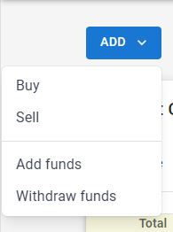
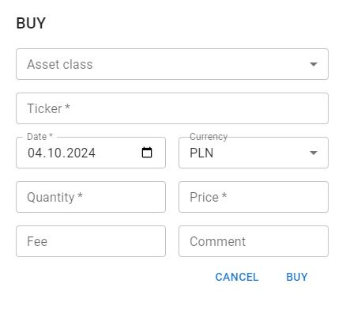
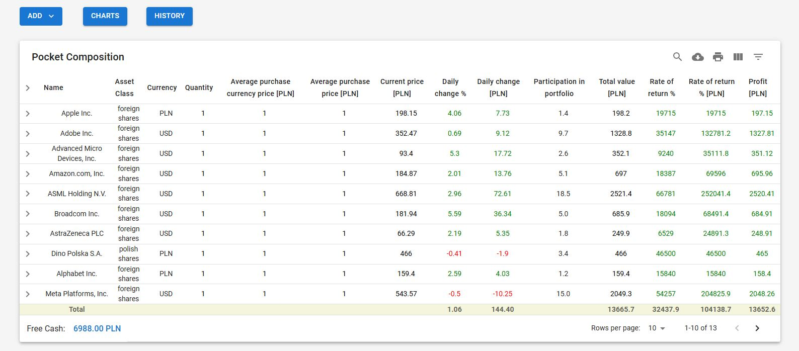
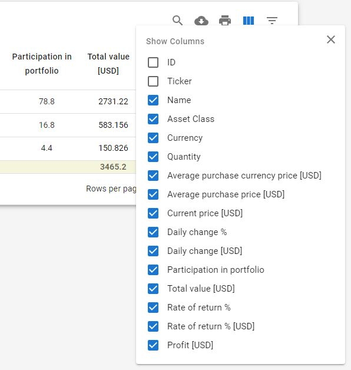

# FundTracker

FundTracker is application written using Django and React.js that helps track my financial investments. Program allows to keep track of various financial investments, such as stocks, mutual funds, and bonds. 

App provides access to all data and functionalities via a RESTful API, enabling seamless integration with fronted. This API allows users to retrieve and manage information about their investments, with all analytical operations, such as calculating financial indicators and metrics, handled efficiently on the backend

Features:
- Important operations: You can buy, sell investments, make withdraw and add funds.

    

    
- Automaticly updates investment values: Program automaticly calculate the most important indicators of your investments to be able to checking the results in real time. All tables are interactive, which allows you to adapt them to your needs.

- Charts - allows see values and indicators in the time. You can see the specifics of your investments in graphical form.

- Generate reports: FundTracker can generate reports that provide insights into your portfolio performance, including overall returns, individual investment performance, and asset allocation. - ToDo

- Scoring app - This feature allows you find and select, based on calculated ratings, the best companies to you portfolio - ToDo

## Table of Contents

- [Installation](#installation)
- [Usage](#usage)
- [Contributing](#contributing)
- [License](#license)

## Installation

To install FundTracker, follow these steps:

1. Clone the repository: `git clone https://github.com/your-username/FundTracker.git`
2. Navigate to the project directory: `cd FundTracker`
3. Install the required dependencies: `pip install -r requirements.txt`

## Usage

To use FundTracker, follow these steps:

1. Open the terminal and navigate to the project directory.
2. Run the program: `python fundtracker.py`
3. Follow the on-screen instructions to track your financial investments.

## Contributing

Contributions are welcome! If you'd like to contribute to FundTracker, please follow these guidelines:

1. Fork the repository.
2. Create a new branch: `git checkout -b feature/your-feature-name`
3. Make your changes and commit them: `git commit -m "Add your commit message"`
4. Push your changes to your forked repository: `git push origin feature/your-feature-name`
5. Open a pull request on the main repository.

## License

FundTracker is licensed under the [MIT License](LICENSE).
