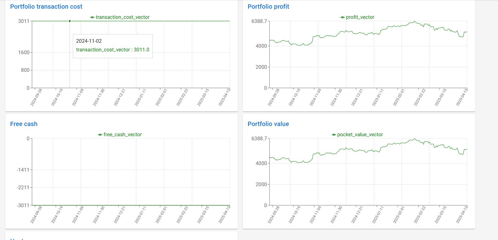

# FundTracker

FundTracker is application written using Django and React.js that helps track my financial investments. Program allows to keep track of various financial investments, such as stocks, mutual funds, and bonds.

App provides access to all data and functionalities via a RESTful API, enabling seamless integration with fronted. This API allows users to retrieve and manage information about their investments, with all analytical operations, such as calculating financial indicators and metrics, handled efficiently on the backend

Features:

- **Important operations:** You can buy, sell investments, make withdraw and add funds.

  

  

- **Automaticly updates investment values:** Program automaticly calculate the most important indicators of your investments to be able to checking the results in real time. All tables are interactive, which allows you to adapt them to your needs.
  

- **Charts:** - allows see values and indicators in the time. You can see the specifics of your investments in graphical form.
  
- **Generate reports:** FundTracker can generate reports that provide insights into your portfolio performance, including overall returns, individual investment performance, and asset allocation. - ToDo

- **Scoring app:** This feature allows you find and select, based on calculated ratings, the best companies to you portfolio - ToDo

## Table of Contents

- [Tech Stack](#tech-stack)
- [Project Structure](#project-structure)
- [Installation](#installation)
- [Usage](#usage)
- [API](#api)
- [License](#license)

## Tech Stack

- **Backend:** Django, Django REST Framework, djangorestframework-simplejwt
- **Frontend:** React.js, Vite, Material-UI, Recharts, Axios
- **Database:** (Configured in Django, e.g., SQLite/PostgreSQL)
- **Other:** dayjs, d3, chart.js

## Project Structure

- `backend/` - Django backend (API, authentication, core logic)
- `frontend/` - React frontend (UI, charts, tables)
- `images/` - Screenshots and documentation images

## Installation

### Backend

1. Navigate to the backend directory:
   ```
   cd backend
   ```
2. Install Python dependencies:
   ```
   pip install -r requirements.txt
   ```
3. Set up environment variables (e.g., `.env` for Django secrets, database settings).

4. Run migrations:

   ```
   python manage.py migrate
   ```

5. Start the backend server:
   ```
   python manage.py runserver
   ```

### Frontend

1. Navigate to the frontend directory:
   ```
   cd frontend
   ```
2. Install Node.js dependencies:
   ```
   npm install
   ```
3. Set up environment variables in `.env` (e.g., `VITE_API_URL=http://localhost:8000/`).

4. Start the frontend development server:
   ```
   npm run dev
   ```

## Usage

- Access the frontend at `http://localhost:5173/` (default Vite port).
- Register or log in to your account.
- Add, buy, sell, or manage investments and view analytics.

## API

- The backend exposes a RESTful API under `/api/`.
- Authentication uses JWT tokens (see login/register endpoints).
- Example usage: see [frontend/src/api.js](frontend/src/api.js).

## License

FundTracker is licensed under the [MIT License](LICENSE).
